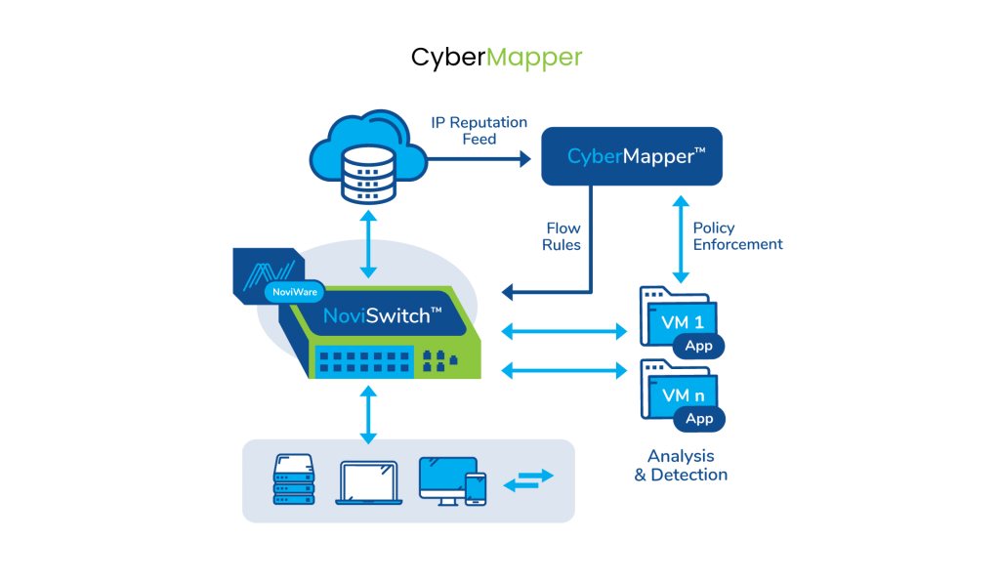
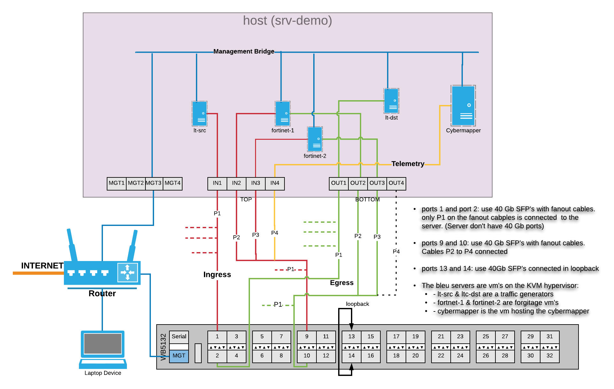
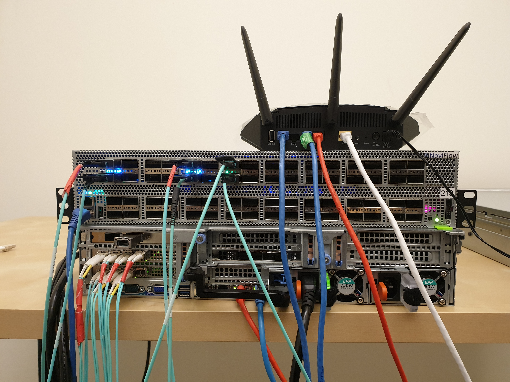
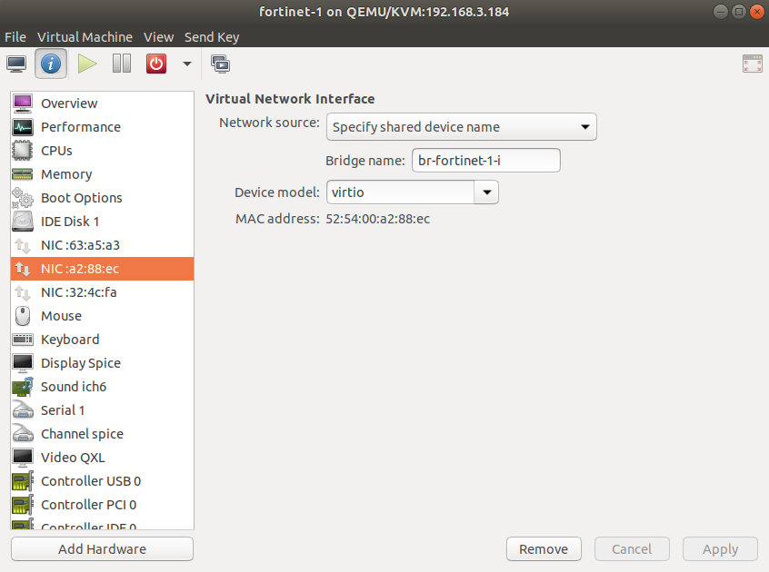
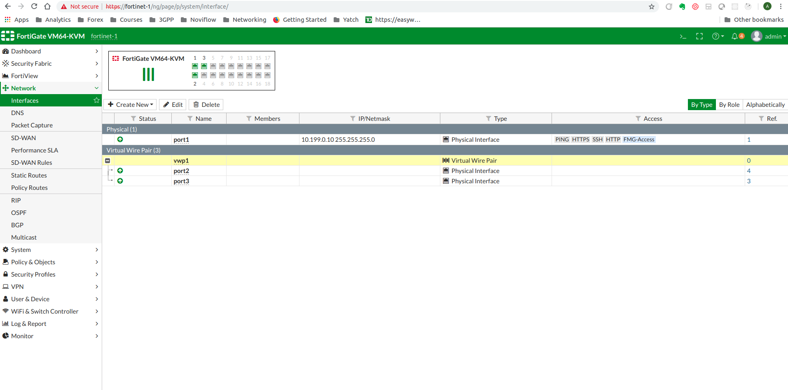
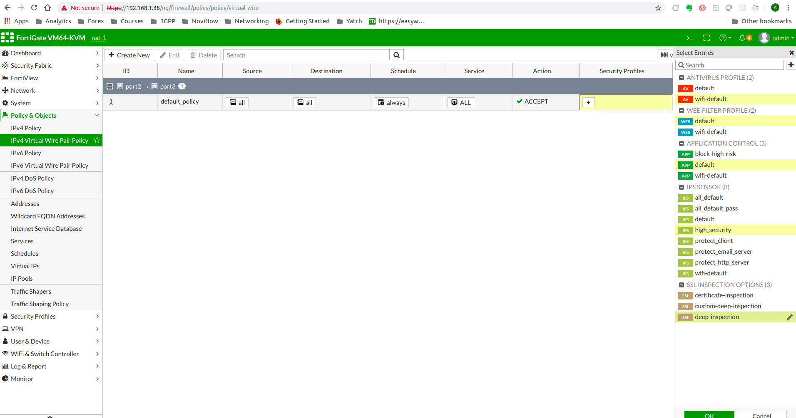
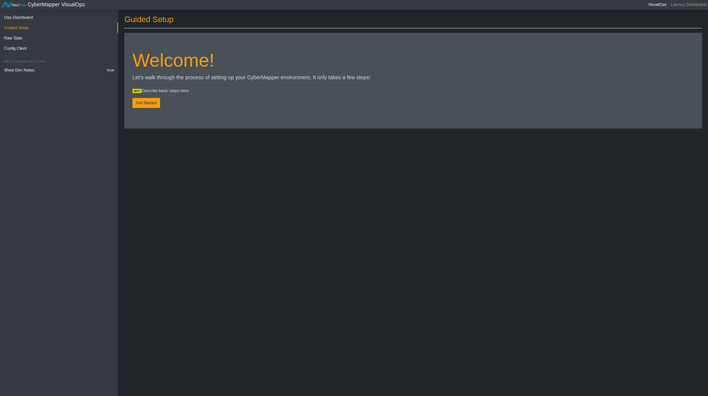
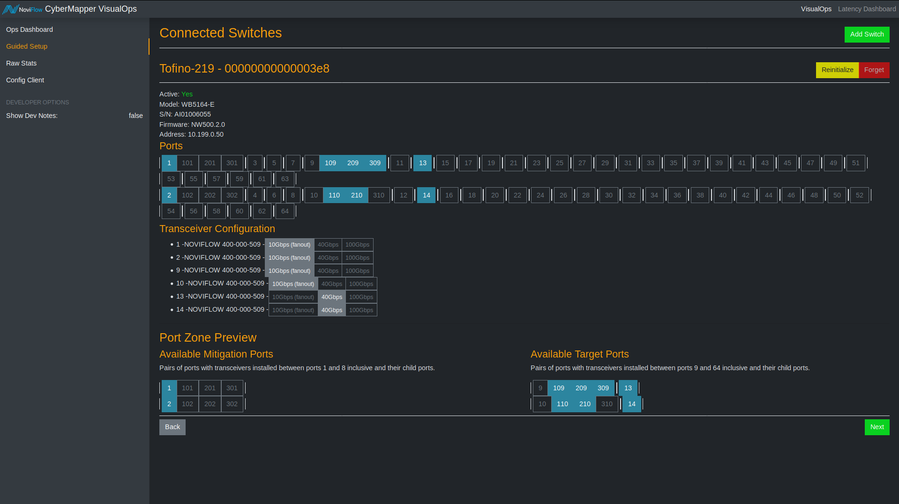
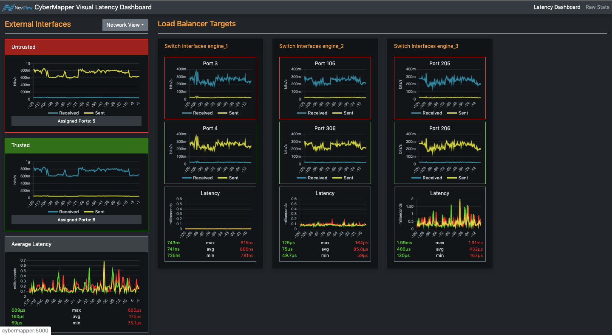

# Demo Lab setup Guide v0.0.4

These instructions include the requirements and guided steps to allow a partner to set up Noviflows CyberMapper 3.3 Load balancing demo with Fortigate Virtual firewalls.

CyberMapper \.tm  
Security Load Balancer RELEASE 3.3.0  
Dynamic scaling, visualisation and mitigation of cybersecurity services

<P>

CyberMapper Security Load Balancer offers major performance and dynamic scalability improvements of network
security solutions, reduces overall security costs, and enables real-time automation of security solution mitigation.
CyberMapper boosts the capabilities of cybersecurity services by off-loading data monitoring, inspection and handling
functions to programmable network switches which are far more efficient at packet processing than general purpose
servers, often enabling huge savings by greatly simplifying network architectures and reducing or even eliminating the
need to duplicate or overprovision network resources. CyberMapper also features the vOPS Visual Operations interface
that greatly simplifies the configuration and management of security tool clusters, eases the setup of load balancing and
enables vendor independent measurement of traffic latency through security assets.

</P>

## Bill of Materiel
_______________

| # of items | Items |
|-------------------------------|-----------------------------------------------------------------------------------------------------------------------------------------------------------------------------------------------------------------------------------------------------------------------------------------------------------------------------------------------------------------------------------------------|
| 1 | Server that will host the Virtual Machine's, you you will need a server with "full height 8x PCIe 3.0 or above slots" for each NIC required and that if using a single CPU system, you will need to make sure that the PCIe slots are actually active as generally half or most are assigned to the second physical CPU. With a suggesion of alteast 64 GB’s of memory and 1 TB of disk space |
| 1 | Tofino based Edge-Core Switch |
| 1 | Noviware 500.2.2 (Provided by Noviflow) |
| 1 | Switch license with INT capibilities enabled (Provided by Noviflow)|
| 1 | CyberMapper 3.3 (Beta version) (Provided by Noviflow) |
| 1 | CyberMapper license (Provided by Noviflow) |
| 2 | Intel NIC cards with 4 - 10Gb fiber ports. |
| 6 | 40Gb fiber sfp's (Noviconnect SFP+ SR4 40G Optical Transceiver) |
| 8 | 10Gb fiber sfp's Noviconnect (NoviConnect 508 SFP+ ER 10G Optical Transceiver) |
| 1 | Fiber cable Noviconnect |
| 4 | Fan out fiber cables Noviconnect |
| 1 | Router with at least 4 - 1GB ports |
| 5 | Ethernet cat 6 cables |
| 2 | FortiGate VM64-KVM v6.0.3 |
| 2 | Fortigate licenses activated|
| 1 | docker-compose version 1.24.1, build 4667896b (installed on CyberMapper VM) |
| 1 | Docker version 19.03.2, build 6a30dfc (installed on CyberMapper VM) |
| 3 | Ubuntu 18 VM’s that will host load tools and Cybermapper |
| 1 | ApacheBench, Version 2.3  (installed on source load tool VM) |
| 1 | parallel version 20161222 (installed on source load tool VM) |
| 1 | lighttpd/1.4.45 (ssl) - a light and fast webserver  (installed on destination load tool VM) |
| 1 | Ubuntu 18.04.3 LTS (installed on the host server) |
| 1 | QEMU emulator version 2.11.1(Debian 1:2.11+dfsg-1ubuntu7.18) (installed on the host server) |
| 1 | Virt-manger 1.5.1 (installed on the host server) |
| 1 | libvirtd (libvirt) 4.0.0 (installed on the host server) |

## Network configuration

Then traffic network uses subnet 10.0.0.0/24

The management network uses subnet 10.199.0.0/24

No L3 subnet required for telemetry

The lab is setup using a contained network environment behind a router. we reserved static ip's for all nodes inside the setup.
The LAN on the router is configured with network 10.199.0.0/24. IP's 10.199.0.60-255 are reserved for DHCP allocation.
The table below lists the statics IP's configured on the different nodes in the lab setup


| Host Name   | IP Address  | Description                                                          |
|-------------|-------------|----------------------------------------------------------------------|
| cybermapper | 10.199.0.40 | VM on DELL host machine where cybermapper and analyzer are installed |
| lt-src      | 10.199.0.10 | VM on DELL host machine where traffic generation tools is installed  |
| lt-dst      | 10.199.0.11 | VM on DELL host machine where traffic generation tools is installed  |
| fortinet-1  | 10.199.0.20 | VM with first Fortinet Fortigate VM                                  |
| fortinet-2  | 10.199.0.21 | VM with second Fortinet Fortigate VM                                 |
| router      | 10.199.0.1  | Netgear Router used for local LAN and to connect to internet         |
| noviswtich  | 10.199.0.50 | 64 port Tofino EdgeCore NoviSwtich                                   |
| srv-demo  | 10.199.0.61 | host server                                   |

Wire diagram



Connected lab example




## Fortigate VM setup
_______________

The Fortigate VM's are configured with 3 network interfaces, the first interface `port1` is for management and the other 2; 
`port2, port3` are for ingress and egress traffic.

You can use macvtap for the management port but you have to use bridges for the traffic ports. Below is an example set of commands used on the host server to create bridges for the Forigate VM's. Make sure you persist those changes or  automaticlly run these configuration comments everytime the server is restarted.


```
brctl addbr br-fortinet-1-i
brctl addbr br-fortinet-1-o
brctl addbr br-fortinet-2-i
brctl addbr br-fortinet-2-o
brctl addif br-fortinet-1-i enp96s0f1
brctl addif br-fortinet-1-o enp94s0f1
brctl addif br-fortinet-2-i enp96s0f2
brctl addif br-fortinet-2-o enp94s0f2
ip link set br-fortinet-1-i up
ip link set br-fortinet-1-o up
ip link set br-fortinet-2-i up
ip link set br-fortinet-2-o up
```

Make sure all interfaces you use are up on the host machine
```
ip link set enp96s0f1 up
ip link set enp94s0f1 up
ip link set enp96s0f2 up
ip link set enp94s0f2 up
```

The Fortigate VM's validate their licenses at least once a day . This is why it needs access to the internet, why the demo setup includes a router, and why you will need to add a default route on the Fortigate VM's

Choose your favorite tool to setup your VM's. A recommended tool is Virtual Machine Manager to configure vm's on the host server from a remote host. Use the qcow2 that was supplied and configure the network interfaces using virtio. The qcow2 can only be downloaded from the fortinet website https://support.fortinet.com/Download/VMImages.aspx

Make sure you install these packages on the KVM host server if you plan on using qemu and virt-manager.

```
sudo apt install qemu-kvm libvirt-bin bridge-utils virt-manager
sudo apt update
sudo service libvirtd start
sudo update-rc.d libvirtd enable
```

Also make sure you disable all firewalls on the host server.


VM ressource Specifications:
* vCPU:   8  
* Memory: 8Gb  
* Disk:   20Gb  



example resulting xml file:
```
<domain type='kvm' id='6'>
  <name>fortinet-1</name>
  <uuid>bac5dd4c-52cf-41b7-91e6-3b9e75bb56f4</uuid>
  <title>fortinet-1</title>
  <memory unit='KiB'>6291456</memory>
  <currentMemory unit='KiB'>6291456</currentMemory>
  <vcpu placement='static'>6</vcpu>
  <resource>
    <partition>/machine</partition>
  </resource>
  <os>
    <type arch='x86_64' machine='pc-i440fx-bionic'>hvm</type>
    <boot dev='hd'/>
  </os>
  <features>
    <acpi/>
    <apic/>
    <vmport state='off'/>
  </features>
  <cpu mode='custom' match='exact' check='full'>
    <model fallback='forbid'>Skylake-Server-IBRS</model>
    <feature policy='require' name='hypervisor'/>
  </cpu>
  <clock offset='utc'>
    <timer name='rtc' tickpolicy='catchup'/>
    <timer name='pit' tickpolicy='delay'/>
    <timer name='hpet' present='no'/>
  </clock>
  <on_poweroff>destroy</on_poweroff>
  <on_reboot>restart</on_reboot>
  <on_crash>destroy</on_crash>
  <pm>
    <suspend-to-mem enabled='no'/>
    <suspend-to-disk enabled='no'/>
  </pm>
  <devices>
    <emulator>/usr/bin/kvm-spice</emulator>
    <disk type='file' device='disk'>
      <driver name='qemu' type='qcow2'/>
      <source file='/data/pool/fortinet-1.qcow2'/>
      <backingStore/>
      <target dev='hda' bus='ide'/>
      <alias name='ide0-0-0'/>
      <address type='drive' controller='0' bus='0' target='0' unit='0'/>
    </disk>
    <controller type='usb' index='0' model='ich9-ehci1'>
      <alias name='usb'/>
      <address type='pci' domain='0x0000' bus='0x00' slot='0x07' function='0x7'/>
    </controller>
    <controller type='usb' index='0' model='ich9-uhci1'>
      <alias name='usb'/>
      <master startport='0'/>
      <address type='pci' domain='0x0000' bus='0x00' slot='0x07' function='0x0' multifunction='on'/>
    </controller>
    <controller type='usb' index='0' model='ich9-uhci2'>
      <alias name='usb'/>
      <master startport='2'/>
      <address type='pci' domain='0x0000' bus='0x00' slot='0x07' function='0x1'/>
    </controller>
    <controller type='usb' index='0' model='ich9-uhci3'>
      <alias name='usb'/>
      <master startport='4'/>
      <address type='pci' domain='0x0000' bus='0x00' slot='0x07' function='0x2'/>
    </controller>
    <controller type='pci' index='0' model='pci-root'>
      <alias name='pci.0'/>
    </controller>
    <controller type='ide' index='0'>
      <alias name='ide'/>
      <address type='pci' domain='0x0000' bus='0x00' slot='0x01' function='0x1'/>
    </controller>
    <controller type='virtio-serial' index='0'>
      <alias name='virtio-serial0'/>
      <address type='pci' domain='0x0000' bus='0x00' slot='0x08' function='0x0'/>
    </controller>
    <interface type='direct'>
      <mac address='52:54:00:63:a5:a3'/>
      <source dev='eno3' mode='bridge'/>
      <target dev='macvtap6'/>
      <model type='virtio'/>
      <alias name='net0'/>
      <address type='pci' domain='0x0000' bus='0x00' slot='0x03' function='0x0'/>
    </interface>
    <interface type='bridge'>
      <mac address='52:54:00:a2:88:ec'/>
      <source bridge='br-fortinet-1-i'/>
      <target dev='vnet0'/>
      <model type='virtio'/>
      <alias name='net1'/>
      <address type='pci' domain='0x0000' bus='0x00' slot='0x04' function='0x0'/>
    </interface>
    <interface type='bridge'>
      <mac address='52:54:00:32:4c:fa'/>
      <source bridge='br-fortinet-1-o'/>
      <target dev='vnet1'/>
      <model type='virtio'/>
      <alias name='net2'/>
      <address type='pci' domain='0x0000' bus='0x00' slot='0x05' function='0x0'/>
    </interface>
    <serial type='pty'>
      <source path='/dev/pts/4'/>
      <target type='isa-serial' port='0'>
        <model name='isa-serial'/>
      </target>
      <alias name='serial0'/>
    </serial>
    <console type='pty' tty='/dev/pts/4'>
      <source path='/dev/pts/4'/>
      <target type='serial' port='0'/>
      <alias name='serial0'/>
    </console>
    <channel type='spicevmc'>
      <target type='virtio' name='com.redhat.spice.0' state='disconnected'/>
      <alias name='channel0'/>
      <address type='virtio-serial' controller='0' bus='0' port='1'/>
    </channel>
    <input type='mouse' bus='ps2'>
      <alias name='input0'/>
    </input>
    <input type='keyboard' bus='ps2'>
      <alias name='input1'/>
    </input>
    <graphics type='spice' port='5903' autoport='yes' listen='127.0.0.1'>
      <listen type='address' address='127.0.0.1'/>
    </graphics>
    <sound model='ich6'>
      <alias name='sound0'/>
      <address type='pci' domain='0x0000' bus='0x00' slot='0x06' function='0x0'/>
    </sound>
    <video>
      <model type='qxl' ram='65536' vram='65536' vgamem='16384' heads='1' primary='yes'/>
      <alias name='video0'/>
      <address type='pci' domain='0x0000' bus='0x00' slot='0x02' function='0x0'/>
    </video>
    <redirdev bus='usb' type='spicevmc'>
      <alias name='redir0'/>
      <address type='usb' bus='0' port='1'/>
    </redirdev>
    <redirdev bus='usb' type='spicevmc'>
      <alias name='redir1'/>
      <address type='usb' bus='0' port='2'/>
    </redirdev>
    <memballoon model='virtio'>
      <alias name='balloon0'/>
      <address type='pci' domain='0x0000' bus='0x00' slot='0x09' function='0x0'/>
    </memballoon>
  </devices>
  <seclabel type='dynamic' model='apparmor' relabel='yes'>
    <label>libvirt-bac5dd4c-52cf-41b7-91e6-3b9e75bb56f4</label>
    <imagelabel>libvirt-bac5dd4c-52cf-41b7-91e6-3b9e75bb56f4</imagelabel>
  </seclabel>
  <seclabel type='dynamic' model='dac' relabel='yes'>
    <label>+64055:+113</label>
    <imagelabel>+64055:+113</imagelabel>
  </seclabel>
</domain>
```
Access the Fortigate VM using the console

login using username:admin and password: none just press Enter

Once you have logged into the VM's cli, it will be time to configure the network settings so we you can access it's web interface and configure it from there.

Start by configuring static ip
```
config system interface
    edit port1
        set mode static
        set ip 10.199.0.10 255.255.255.0
    end
```
configure default route:

```
config router static
    edit 1
        set device port1
        set gateway 10.199.0.1
    end
```

enable vlan forwarding
```
config system interface
    edit port2
        set vlanforward enable
    end
```

```
config system interface
    edit port3
        set vlanforward enable
    end
```

once that is configured you should be able to reach the fortigate VM's GUI inteface by typing the address in a browser http://10.199.0.10

### Adding license

First You will need to upload the Fortigate license file that you have activated

### Adding a virtual wire pair

The traffic will pass through the Fortigate firewalls Virtual Wire pairs, which are 2 ports setup in a bump in the wire configuration. So Next step is to add a Virtual wire pair

To add a virtual wire pair, go to Network > Interfaces and select Create New > Virtual Wire Pair. Select the interfaces to add to the virtual wire pair to, optionally enable Wildcard VLAN and select OK.

1. The virtual wire pair appears on the Interface list.

2. Use the following command to add a virtual wire pair from the CLI that enables the wildcard VLAN feature:

```
config system virtual-wire-pair
    edit vwp1
        set member port3 port4
        set wildcard-vlan enable
end
```



### Adding a virtual wire pair and virtual wire pair policy

note icon Interfaces used in a virtual wire pair cannot be used to access the ISFW FortiGate. Before creating a virtual wire pair, make sure you have a different port configured to allow admin access using your preferred protocol.

1. Go to Network > Interfaces and select Create New > Virtual Wire Pair.

2. Select the interfaces to add to the virtual wire pair. These interfaces cannot be part of a switch, such as the default lan/internal interface.
3. (Optional) If desired, enable Wildcard VLAN.
4. Select OK.
5. Go to Policy & Objects > IPv4 Virtual Wire Pair Policy, select the virtual wire pair, and select Create New.
6. Select the direction that traffic is allowed to flow.
Configure the other firewall options as desired.
7. Select OK.
8. If necessary, create a second virtual wire pair policy to allow traffic to flow in the opposite direction.

Add security rules as desired.



### Repeat all the same steps for as many Fortinet VM's as you would like to use.

## Traffic Generator VMs Setup
_______________

Traffic Generator VM's ressource Specifications:

* vCPU:   8  
* Memory: 8 Gb  
* Disk:   100 Gb  

### Traffic Source Tools (lt-src)

Create your VM by installing Ubuntu 18.04 use the same tool and process you used to create the firewall vm's

Traffic generator VM needs 2 macvtap interfaces one for management and one for traffic

configure the management interface with a static ip of 10.199.0.20
configure the traffic interface with a static ip of 10.0.0.1/24
and give the vm the host name lt-src

install the needed tools:
```
root@lt-src:~# apt update
root@lt-src:~# apt install parallel
root@lt-src:~# apt install iperf3
root@lt-src:~# apt-get install apache2-utils
root@lt-src:~# apt install curl
```
set the traffic interface mtu to 1400

```
root@lt-src:~# ip link set ens4 mtu 1400
```
add that line to `/etc/rc.local` so that its set correctly at each restart
and make sure `rc.local` is executable

create URL input file for traffic generation script
```
root@lt-src:~# cd ~
root@lt-src:~# for i in {2..100} ; do srcip=10.0.0.$i; echo http://$srcip/ >> myurls.txt ; done
```

create a script with executable permissions called `./run_demo_traffic.sh` with the content below

```
#! /bin/sh

while true
do
  cat myurls.txt | parallel -j 99 'ab -n 50000000 -c 5 {}'
  wait
  echo "All done"
done
```

### Traffic Destination Tools (lt-dst)

Create your VM by installing Ubuntu 18.04 use the same tool and process you used to create the firewall vm's

Setup traffic generator VM needs 2 interfaces one for management and one for traffic

configure the management interface with a static ip of 10.199.0.21/24 configure the traffic interface with 99 static ip of 10.0.0.2/24 to 10.0.0.100 and give the vm the host name lt-dst

install the needed tools:

```
root@lt-dst:~# apt update
root@lt-dst:~# apt install lighttpd
root@lt-dst:~# sudo systemctl enable lighttpd
```

set the traffic interface mtu to 1400:

```
root@lt-dst:~# ip link set ens4 mtu 1400
```

add the last command line to the file `/etc/rc.local` so that its set correctly at each VM restart

make sure `rc.local` is executable

## CyberMapper VM
_______________

VM ressource Specifications:

* vCPU:   4  
* Memory: 4 Gb  
* Disk:   100Gb  

Create your VM by installing Ubuntu 18.04 use the same tool and process you used to create the firewall VM's

The CyberMapper VM needs 2 interfaces one for management and one for telemetry traffic

Configure the management interface with a static ip of 10.199.0.30/24, no need to give the telemetry interface an IP address, since the telemetry connection will be a direct L2 connection.

Use the CyberMapper 3.3 Installation Guide to install and configure CyberMapper 3.3 plus the Analyzer.

### Setup linux services

To Make sure the services are always running create systemd services for CyberMapper and the Analyzer

Example:
```
superuser@cybermapper:~$ cat /etc/systemd/system/cybermapper.service
[Unit]
Description=CyberMapper Container
After=docker.service
Requires=docker.service

[Service]
TimeoutStartSec=0
Restart=always
ExecStartPre=/usr/local/bin/docker-compose -f /root/build_vops2/noviflow_app/dso-cybermapper/vops_v2/docker-compose.yml down
#ExecStartPre=-/usr/bin/docker rm %n
#ExecStartPre=/usr/bin/docker pull redis
ExecStart=/usr/local/bin/docker-compose -f /root/build_vops2/noviflow_app/dso-cybermapper/vops_v2/docker-compose.yml up

[Install]
WantedBy=multi-user.target
```

## Configure CyberMapper and the Switch using the Visual Operations tool
_______________
Once everything is installed you should be able to configure CyberMapper using the VisualOps Dashboard and start sending traffic.

  
<br>
<br>
<br>
  
<br>
<br>
<br>
